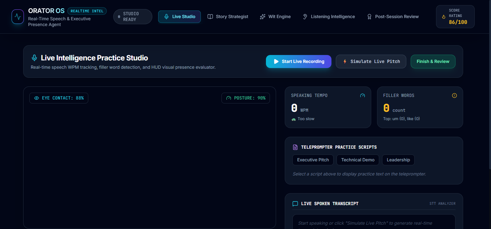

# ORATORS-OS

## Overview

ORATORS-OS is an educational web platform designed to help users discover books, learning resources, activities, and self-improvement content. The platform provides a simple and engaging way to explore knowledge and personal development opportunities.

## Features

- 📚 Book Recommendations
- 🎯 Learning Activities
- 🎓 Educational Resources
- 📖 Self-Development Content
- 📱 Responsive Design
- 🔍 Easy Navigation

## Technologies Used

- HTML5
- CSS3
- JavaScript
- Netlify

## Live Demo

🌐 [Visit ORATORS-OS](https://orator-os.netlify.app)


## Project Structure

```text
MyWebsite/
├── index.html
├── style.css
├── script.js
├── assets/
└── images/
```

## Development Process 

This project was developed using AI-assisted development tools, including ChatGPT and Antigravity, to accelerate development, generate ideas, improve user experience, and streamline implementation.

The project structure, content organization, customization, testing, and deployment were reviewed and managed throughout the development process.

## Purpose


## Future Enhancements

- User Login & Registration
- Personalized Recommendations
- Search Functionality
- Bookmark Favorite Resources
- Progress Tracking Dashboard

## Homepage Screenshot



## Author

**SHAIK MUSRATH**

B.Tech Computer Science & Engineering (2025)

GitHub Repository: #ORATOR-OS.
